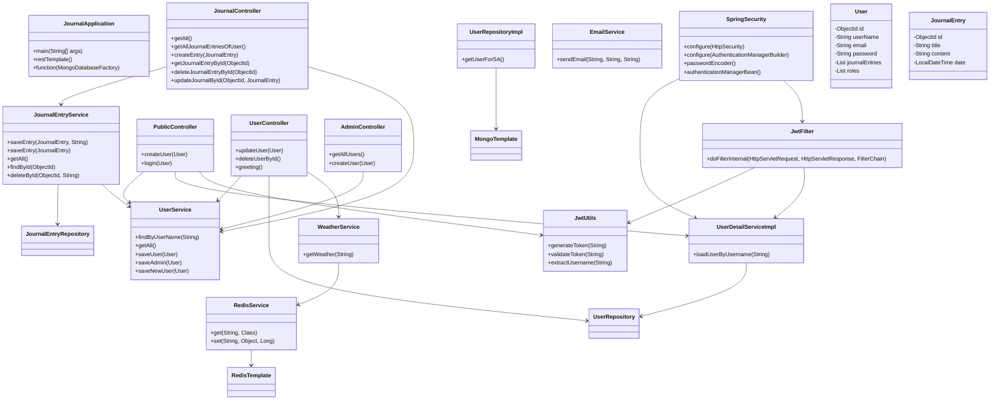

# JournalApp Architecture

This document describes the core architecture of the JournalApp project and includes a UML-style component diagram.

## Architecture summary

The application is built in layers:

- `controller` layer for REST API entry points
- `service` layer for business logic and orchestration
- `repository` layer for MongoDB persistence
- `config` layer for security and infrastructure configuration
- `entity` layer for domain models stored in MongoDB
- `filter` layer for JWT authentication

## Component interactions

- `PublicController` handles user registration and login
- `UserController` supports profile updates, deletion, and weather greeting
- `JournalController` handles journal entry CRUD for authenticated users
- `AdminController` manages admin-specific operations
- `UserService` provides user lookup, creation, and admin role assignment
- `JournalEntryService` saves and deletes entries while associating them with users
- `WeatherService` fetches weather data and is designed to use `RedisService` for caching
- `JwtFilter` validates tokens and injects authentication into requests
- `SpringSecurity` configures route access and security policy

## UML class diagram

## Notes

- The scheduler `UserScheduler` is not currently annotated as a Spring component, so scheduled jobs will not run until fixed.
- `RedisService` is defined but not wired with `@Service`, so it may not be available for dependency injection.
- The weather flow is designed for caching, but `RedisService` caching is not actively used in `WeatherService`.
- `UserRepositoryImpl` is a custom repository class that is not used by the main controller flow.

## Recommended improvements

1. Add `@Service` or `@Component` to `RedisService`
2. Add `@Component` to `UserScheduler`
3. Replace hardcoded API key with `application.properties` configuration
4. Add validation and error handling for request payloads
5. Add API docs (Swagger/OpenAPI)

---

For an even richer README, we can add API examples, environment variables, and a deployment section next.