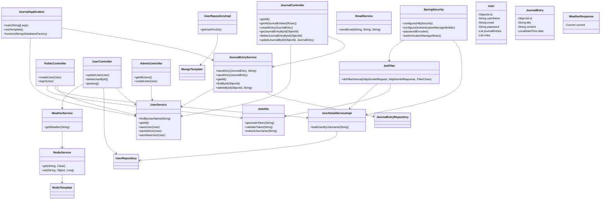

# JournalApp

A Spring Boot journal management API with MongoDB persistence, JWT authentication, role-based access control, and a weather-aware user experience.

## 🚀 What this project does

- User registration and login using JWT
- `USER` and `ADMIN` role support
- Personal journal entry CRUD operations
- Admin-only user listing and admin user creation
- Weather greeting on user profile endpoint
- MongoDB storage for users and journal entries
- Redis-ready weather caching layer
- Email scheduler structure for weekly summaries

## 🧠 Architecture overview

This application follows a layered architecture:

- `controller` layer handles HTTP requests
- `service` layer implements business logic
- `repository` layer handles MongoDB persistence
- `config` layer manages security and Redis beans
- `entity` layer defines MongoDB documents
- `filter` layer validates JWT tokens

## 📦 Key components

- `PublicController`: register and login endpoints
- `UserController`: authenticated user profile and delete endpoints
- `JournalController`: journal CRUD and retrieval
- `AdminController`: admin management endpoints
- `SpringSecurity`: route authorization and JWT filter setup
- `JwtFilter`: JWT validation and security context population
- `UserService`, `JournalEntryService`, `WeatherService`, `RedisService`, `EmailService`
- Repositories: `UserRepository`, `JournalEntryRepository`

## 🌐 UML Architecture Diagram



## 🛠️ Setup and run

1. Ensure MongoDB is running locally on `mongodb://localhost:27017/JournalApplication`
2. Configure email and Redis if needed for production features
3. Start the app:

```bash
./mvnw spring-boot:run
```

## 🔌 Example API usage

1. Register a new user:

```bash
curl -X POST http://localhost:8080/public/createuser \
  -H 'Content-Type: application/json' \
  -d '{"userName":"alice","password":"secret"}'
```

2. Login and obtain JWT:

```bash
curl -X POST http://localhost:8080/public/login \
  -H 'Content-Type: application/json' \
  -d '{"userName":"alice","password":"secret"}'
```

3. Use token for protected endpoints:

```bash
curl http://localhost:8080/user \
  -H 'Authorization: Bearer <JWT_TOKEN>'
```

4. Create a journal entry:

```bash
curl -X POST http://localhost:8080/journal/create \
  -H 'Content-Type: application/json' \
  -H 'Authorization: Bearer <JWT_TOKEN>' \
  -d '{"title":"My day","content":"Learned Spring Boot."}'
```

## ⚠️ Notes and improvements

- `RedisService` is defined but currently not annotated as a Spring bean; it should be annotated with `@Service`.
- `UserScheduler` is not annotated with `@Component`, so scheduled execution is likely inactive.
- `WeatherService` has a hardcoded API key and does not currently use Redis caching properly.
- `UserRepositoryImpl` is an unused custom repository definition.

## 📌 Recommended next steps

- Add validation for request payloads
- Enable proper Redis caching for weather responses
- Add unit/integration tests for auth, journal flows, and controllers
- Expose Swagger/OpenAPI documentation for API discovery

---

## 📘 Project structure quick view

```
src/main/java/net/soulhacker/journalApp
  ├── config
  │   ├── RedisConfig.java
  │   └── SpringSecurity.java
  ├── controller
  │   ├── AdminController.java
  │   ├── JournalController.java
  │   ├── PublicController.java
  │   └── UserController.java
  ├── entity
  │   ├── JournalEntry.java
  │   └── User.java
  ├── filter
  │   └── JwtFilter.java
  ├── repository
  │   ├── JournalEntryRepository.java
  │   ├── UserRepository.java
  │   └── UserRepositoryImpl.java
  ├── scheduler
  │   └── UserScheduler.java
  ├── service
  │   ├── EmailService.java
  │   ├── JournalEntryService.java
  │   ├── RedisService.java
  │   ├── UserDetailServiceImpl.java
  │   ├── UserService.java
  │   └── WeatherService.java
  ├── util
  │   └── JwtUtils.java
  └── JournalApplication.java
```
